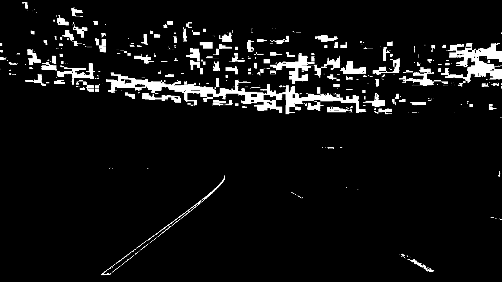

## Writeup Template

### You can use this file as a template for your writeup if you want to submit it as a markdown file, but feel free to use some other method and submit a pdf if you prefer.

---

**Advanced Lane Finding Project**

The goals / steps of this project are the following:

* Compute the camera calibration matrix and distortion coefficients given a set of chessboard images.
* Apply a distortion correction to raw images.
* Use color transforms, gradients, etc., to create a thresholded binary image.
* Apply a perspective transform to rectify binary image ("birds-eye view").
* Detect lane pixels and fit to find the lane boundary.
* Determine the curvature of the lane and vehicle position with respect to center.
* Warp the detected lane boundaries back onto the original image.
* Output visual display of the lane boundaries and numerical estimation of lane curvature and vehicle position.

[//]: # (Image References)

[image1]: ./examples/undistort_output.png "Undistorted"
[image2]: ./test_images/test1.jpg "Road Transformed"
[image3]: ./examples/binary_combo_example.jpg "Binary Example"
[image4]: ./examples/warped_straight_lines.jpg "Warp Example"
[image5]: ./examples/color_fit_lines.jpg "Fit Visual"
[image6]: ./examples/example_output.jpg "Output"
[video1]: ./project_video.mp4 "Video"

## [Rubric](https://review.udacity.com/#!/rubrics/571/view) Points

### Here I will consider the rubric points individually and describe how I addressed each point in my implementation.  

---

### Writeup / README

#### 1. Provide a Writeup / README that includes all the rubric points and how you addressed each one.  You can submit your writeup as markdown or pdf.  [Here](https://github.com/udacity/CarND-Advanced-Lane-Lines/blob/master/writeup_template.md) is a template writeup for this project you can use as a guide and a starting point.  

You're reading it!

### Camera Calibration

#### 1. Briefly state how you computed the camera matrix and distortion coefficients. Provide an example of a distortion corrected calibration image.

The code for this step is contained in the [calibration](calibration.py) file

I used cv2's `findChessboardCorners` function to identify the coordinates of the corners on the undistort version and population imgpoints. Then I used the `calibrateCamera` function with the identified imgpoints to identify the undistortion parameters.

Original:


Undistorted:


### Pipeline (single images)

I have the following classes that make up the pipeline:

1. Frame (frame.py): handles transformation of a single frame and store lanes identified in that frame
2. LaneTracker (lane_tracker.py): keep track of the current and last frame to find the best lanes for the current frame
3. pipeline.py: apply the appropriate methods inside a single pipeline
4. calibration.py: calculate and cache the undistortion and perspective transform parameters

#### 1. Provide an example of a distortion-corrected image.

To demonstrate this step, I will describe how I apply the distortion correction to one of the test images like this one:

Original:


Undistorted:


In `pipeline.py`, I call the appropriate instance methods of Frame:

```
frame.set_undistort_params(calibrate_params)
frame.undistorted = frame.undistort(frame.rgb)
```

`set_undistort_params` sets the undistortion params to the cached undistortion values from `calibration.py` and then `undistort` applies the transformation


#### 2. Describe how (and identify where in your code) you used color transforms, gradients or other methods to create a thresholded binary image.  Provide an example of a binary image result.

I used a combination of color and gradient thresholds to generate a binary image.

1. Color thresholding [pipeline](pipeline.py) #23:
  I used a combination of the l and s channel of the HSV color space. The s channel thresholding is for isolating bright pixels while the l channel is for eliminating dark pixels like shadow.
  

2. Gradient thresholding [pipeline](pipeline.py) #44:
  I use a combination of absolute, magnitude and gradient thresholding:
  

3. Combining the two threshold gives me [pipeline](pipeline.py) #88:
  

4. Then I apply a region of interest mask to isolate the lane area we're interested in [pipeline](pipeline.py) #92:
  

#### 3. Describe how (and identify where in your code) you performed a perspective transform and provide an example of a transformed image.

Frame has a function `perspective_transform` [frame](frame..py) #126 that calculates the transformation matrix based on the values specified in `calibration.py` then applies the transformation.

```python
def _calculate_perspective_transform_matrix(self, perspective_params):
    src_pts = perspective_params[0]
    dst_pts = perspective_params[1]

    return cv2.getPerspectiveTransform(src_pts, dst_pts)

def perspective_transform(self, img):
    size = img.shape[1], img.shape[0]
    return cv2.warpPerspective(img, self.M, size)
```

top_left = [600,450]
top_right = [680,450]
bottom_right = [1110,720]
bottom_left = [200,720]

top_left_dst = [300,0]
top_right_dst = [850,0]
bottom_right_dst = [850,720]
bottom_left_dst = [300,720]

This resulted in the following source and destination points:

| Source        | Destination   |
|:-------------:|:-------------:|
| 600, 450      | 300, 0        |
| 680, 450      | 850, 0      |
| 1110, 720     | 850, 720      |
| 200, 720      | 300, 720        |

I verified that my perspective transform was working as expected by drawing the `src` and `dst` points onto a test image and its warped counterpart to verify that the lines appear parallel in the warped image.

  

#### 4. Describe how (and identify where in your code) you identified lane-line pixels and fit their positions with a polynomial?

After creating a high-quality warped image, the [LaneTracker](lane_tracker.py) class takes over and tries to find the best lanes.

If there is no previous frame or if we haven't found a high-quality set of lanes in 12 frames, then I start the lane search from scratch using the sliding window method.

If there is a previous frame, and if a good lane was found in fewer than 12 frames ago, then I took a shortcut and just searched around a predetermined margin of where the previous lanes were found.

```python
if self.last_frame and self.last_valid_left_lane_found < 12 and self.last_valid_right_lane_found < 12:
        nonzero, left_lane_inds, right_lane_inds = self._extrapolate_from_last_frame()
    else:
        nonzero, left_lane_inds, right_lane_inds = self._sliding_window()
```

After picking up non-zero (i.e.) white pixels in the search area, I performed a polynomial fitting and populate the coordinates of best-fit line in two [Lane](lane.py) objects.

```python
# Fit a second order polynomial to each
  left_fit_polynomial = np.polyfit(lefty, leftx, 2)
  right_fit_polynomial = np.polyfit(righty, rightx, 2)

  # Generate x and y values for plotting
  left_fitx, right_fitx, left_fity, right_fity = self._fit_polynomial_to_lane_data(left_fit_polynomial, right_fit_polynomial)

  left_lane = Lane(leftx, lefty, left_fit_polynomial, left_fitx, left_fity)
  right_lane = Lane(rightx, righty, right_fit_polynomial, right_fitx, right_fity)
```

At this point I perform a quick sanity check for lane curvature. If it is less than the mandated minimum (195m at 45mph), then I discard the lane(s) and return the last frame's lane(s). This allows the lane detection algorithm to be more resilient to difficult frames.

I keep track of how many frames go by without good lanes being detected and if that number exceeds 12 (at 60fps that's 200ms), then I start the search from scratch.


#### 5. Describe how (and identify where in your code) you calculated the radius of curvature of the lane and the position of the vehicle with respect to center.

I did this in the [Lane](lane.py) object.

```python
def calculate_curvature(self):
    y_eval = np.max(self.nonzeroy)

    ym_per_pix = 30/720 # meters per pixel in y dimension
    xm_per_pix = 3.7/700 # meters per pixel in x dimension

    # Fit new polynomials to x,y in world space
    fit_cr = np.polyfit(self.nonzeroy*ym_per_pix, self.nonzerox*xm_per_pix, 2)
    # Calculate the new radii of curvature
    curve = ((1 + (2*fit_cr[0]*y_eval*ym_per_pix + fit_cr[1])**2)**1.5) / np.absolute(2*fit_cr[0])
    return int(curve)
```

#### 6. Provide an example image of your result plotted back down onto the road such that the lane area is identified clearly.

I implemented this step in lines 148 of [Frame](frame.py).  Here is an example of my result on a test image:


---

### Pipeline (video)

#### 1. Provide a link to your final video output.  Your pipeline should perform reasonably well on the entire project video (wobbly lines are ok but no catastrophic failures that would cause the car to drive off the road!).

Here's a [link to my video result](project_video_output_0_0_.mp4)

---

### Discussion

#### 1. Briefly discuss any problems / issues you faced in your implementation of this project.  Where will your pipeline likely fail?  What could you do to make it more robust?

There are three main steps to this pipeline:
- Image transformation: perform the necessary thresholding and transformation to achieved a clear representation of two lanes in a warped image
- Lane detection: perform a lane detection algorithm on the warped image
- Smoothing, error-proofing.

I know that my pipeline currently does not work well on the challenge video but here's the plan of attack when I have more time:
- I think I can get better results for the first step by playing with the parameters a little more, perhaps add additional colorspace to make the algorithm more robust to changing light conditions.
- The last step is where most of the work is to be done. Right now I have only implemented the curvature sanity check, but smoothing as well as lane distance check could be performed to be more robust to difficult frames.
